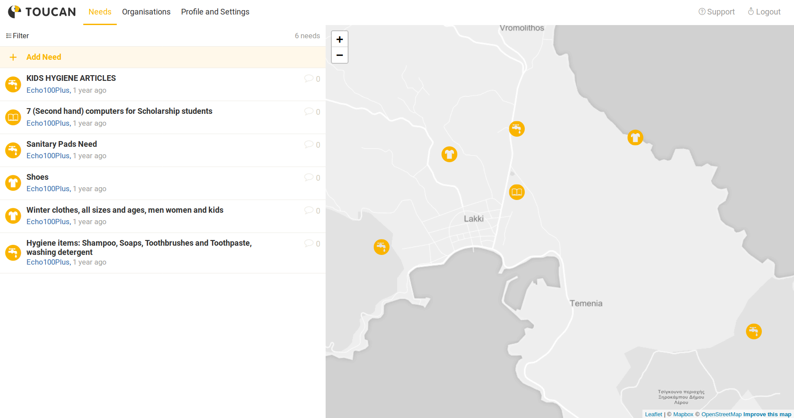

# Toucan Issue Tracker

## Introduction

The Toucan issue tracker is a web application that aims to enable 
cooperation between humanitarian organisations during crisis situations 
in a given area.
It does so by providing a map view that links to issues and conversations.
Issues can be opened/closed/re-opened, similar to the way a technical 
issue tracker would work.

## Features

- Map views for tracking individual issues and organization quarters
- Conversations between users
- Participants of conversations can be notified of changes and new messages
- Notifications of new issues can bet set based on geographic distance

## Glossary

In order to understand how the pieces in Toucan fit together it is useful
to define the actors in the system and the vocabulary used.

*User*
: A user of the Toucan platform.

*Organization*
: A collective of users working together on the Toucan platform. Organizations 
have regular members and administrators. Regular members can create issues on 
behalf of their organisation. Administrators can invite further members to the 
organization and change certain settings for their organisation (such as description).

*Issue*
: An issues is a support request that is posted by a user on behalf of 
an organisation. It is always linked to a location. An issue has a type,
such as medical, shelter etc.     

